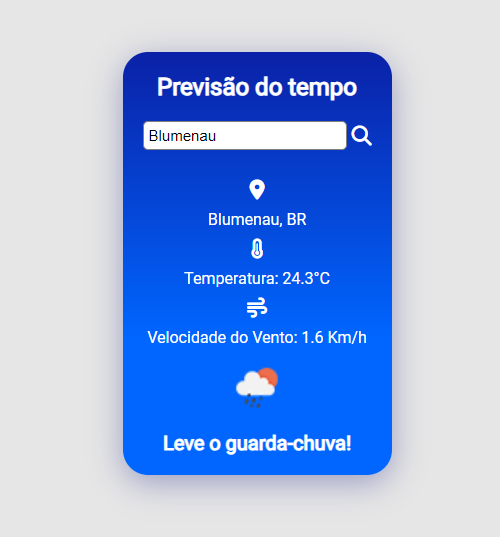

# Api-Tempo

Estou praticando a integração de API's nos projetos.

Vou utilizar a API openWeather para consultar a previsão do tempo em determinada cidade.

Estou utilizando a biblioteca Fontawesome para os ícones
